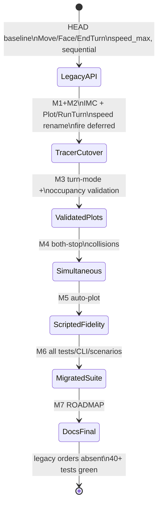

# Implementation Plan: shipsim Slice 3 -- Movement Fidelity (D1, D2, D3)

## Planning Verdict
- verdict: READY
- task_tier: full
- tier_trigger: Migration that fully removes used Order API variants (`Move`/`Face`/`EndTurn`) and replaces them with `Plot`/`RunTurn`; JSON wire order format and snapshot field rename (`speed_max` -> `speed`) change. REQUEST and Killhouse handoff require full tier.
- execution_policy: cost_optimized
- model_routing: current-model-only
- model_tiers: current model serves fast / standard / reasoning; tier labels document intent only.
- reason: Clean Order API break with simultaneous 32-impulse IMC movement, turn-mode at plot submit, fire deferred to turn end. Tracer-bullet-first; blast-radius wire break pre-decided by PRD/ADR-0007 (no shim). Baseline 40 tests green under legacy orders; every presence gate fails at baseline until cutover.

## Repository State (Staleness Contract)
- VCS HEAD: `574677d43ef514ae7c8a6edfeb1f925c30ca64ed`
  <- command: `git -C /mnt/storage/git_home/shipsim rev-parse HEAD` -> `574677d43ef514ae7c8a6edfeb1f925c30ca64ed`
- Git toplevel: `/mnt/storage/git_home/shipsim` (standalone repo; do NOT use parent monorepo).
- Dirty files in scope at plan time: expect clean tree per HANDOFF; if `implementation-plan-slice3.md` is the only new/dirty file, proceed. Any edit to cited `src/*` / `tests/*` / scenarios invalidates affected facts -- re-run citations.
- Discovery timestamp: 2026-07-08.
- Existing user changes to preserve: none planned beyond this plan file; do not touch `tmp/`, killhouse, or sibling projects.

## Repository Findings

Confirmed facts (re-derivable; no line-number dependence):

- Baseline suite green under Move/Face/EndTurn: HANDOFF records `cargo test` -> 40 tests green; `cargo clippy --all-targets` clean. Executor must re-run and record actual count before M1.
  <- evidence: `docs/HANDOFF.md` (verified clean baseline: 40 tests); symbols: `tests/{acceptance,movement,combat,harness,tracer}.rs`.

- Order seam is still declare/resolve: `GameState::apply_order` -> `movement::declare` -> `movement::resolve`.
  <- command: `grep -n "fn apply_order\|fn declare\|fn resolve" src/game_state.rs src/movement.rs`.

- `Order` enum is serde `tag="type", rename_all="snake_case"` with variants `Move`, `Face`, `Fire`, `EndTurn` only -- NO `Plot`/`RunTurn`.
  <- command: `grep -n "enum Order\|Move\|Face\|EndTurn\|Plot\|RunTurn" src/movement.rs` -> Move/Face/EndTurn present; Plot/RunTurn absent. RED baseline for new orders.

- No `impulse` module: `src/lib.rs` mods are board/combat/game_state/hex/movement/prng/scenario/schema/ship/snapshot.
  <- command: `grep -n "pub mod" src/lib.rs`; `ls src/impulse.rs` absent. RED for IMC.

- `Ship` has `speed_max: u32` (not `speed`); `turn_mode` carried unenforced.
  <- command: `grep -n "speed_max\|turn_mode" src/ship.rs src/schema.rs src/snapshot.rs`.

- Ship TOML uses `speed_max`: `data/ships/heavy_cruiser.toml` = 4, `escort.toml` = 3.
  <- command: `grep -n speed data/ships/*.toml`.

- Turn policy is sequential N-hexes: `moves_this_turn` + `BeyondSpeed`; `end_turn` advances scripted one hex then `turn.advance()` and clears move/fire trackers.
  <- command: `grep -n "moves_this_turn\|fn end_turn\|advance_scripted" src/game_state.rs src/movement.rs`.

- Scripted AI ignores speed budget: `advance_scripted_ships` moves at most one adjacent hex per `EndTurn`.
  <- command: `grep -n "fn advance_scripted_ships" -A30 src/game_state.rs`.

- Fire resolves immediately in `resolve` via `combat::resolve_fire` (not deferred).
  <- command: `grep -n "DeclaredOrder::Fire\|resolve_fire" src/movement.rs`.

- Snapshot has no `impulse`; ships expose `speed_max`.
  <- command: `grep -n "impulse\|speed_max\|struct StateSnapshot\|struct ShipSnapshot" src/snapshot.rs`.

- Scenarios: `movement.toml`, `slice1.toml`, `slice1_orders.jsonl`, `tracer.toml`, `combat.toml`. NO `impulse.toml`.
  <- command: `ls scenarios/`.

- JSON orders sample uses move/end_turn:
  <- `scenarios/slice1_orders.jsonl`: `{"type":"move",...}` / `{"type":"end_turn"}`.

- Hex has `direction(facing)->Option<Hex>` and `neighbors`; no step-delta -> facing helper (combat has `bearing_to` for nearest-of-6, usable but plot steps need exact unit-delta match).
  <- command: `grep -n "fn direction\|fn neighbors\|DIRECTIONS" src/hex.rs`.

- CLI is thin: deserialize `Order` JSON lines, `apply_order`, print snapshot. No rule logic.
  <- `src/bin/shipsim.rs`.

- Dependencies: serde, serde_json, toml, thiserror only; no `rand`.
  <- `Cargo.toml`.

- Docs ready: PRD-slice3, CONTEXT-slice3, ADR-0007, ADR-0008; HANDOFF says PLAN is NEXT.
  <- `docs/HANDOFF.md`, `docs/PRD-slice3.md`.

Baseline status / pre-existing failures: none reported. Full suite green under legacy API.
Unsafe/unrun: planner did not re-execute `cargo test` in this session; HANDOFF citation stands -- executor re-runs as first handoff step.
Context docs read: HANDOFF, PRD-slice3, CONTEXT-slice3, ADR-0007, ADR-0008, ROADMAP, implementation-plan-slice2 (structure), src/* and tests/* seams.
Unknowns requiring spikes: none. IMC is a known pure table (DD-IMC); collision/path-cursor rules locked below (DD-COLLISION).

## Requested Outcomes & Non-Goals

Outcomes (from PRD US1-US25 / Implementation Decisions; atomic, verifiable):

| id | kind | outcome |
| --- | --- | --- |
| O1 | explicit | IMC static lookup `moves_on_impulse(speed, impulse) -> bool` for speeds 0..=31, impulses 1..=32; speed 0 never moves. |
| O2 | explicit | Ship field/TOML/snapshot rename `speed_max` -> `speed` (IMC speed; fixed per-ship). |
| O3 | explicit | `Order::Plot { ship, path }` replaces Move/Face; facing implied by each path step. |
| O4 | explicit | Plot validation at submit: adjacency (incl. first step from ship hex), on-board, no step through hex occupied at submit, turn-mode between direction changes. Whole plot rejected, no mutation. |
| O5 | explicit | `Order::RunTurn` replaces EndTurn; resolves impulses 1..=32 atomically. |
| O6 | explicit | Per-impulse simultaneous step collection + atomic apply. |
| O7 | explicit | Same-hex after impulse => both stop (revert movers; deterministic; no ship-order tie-break). Pass-through swap allowed. |
| O8 | explicit | Fire declared during turn, resolved after all movement at turn end, declaration order; combat mechanics (to-hit/shields/bleed/destruction) unchanged. |
| O9 | explicit | Terminal (objective / destruction) checked once at turn end after movement+fire; no mid-impulse wins. |
| O10 | explicit | Scripted ship auto-generates turn-mode-valid greedy plot from waypoints when RunTurn and no player plot. |
| O11 | explicit | Snapshot: `impulse: u8` (0 between turns); ship `speed` + existing `turn_mode`. |
| O12 | explicit | `scenarios/impulse.toml` headline scenario; existing scenarios/orders/tests/CLI updated. |
| O13 | explicit | Declare/resolve seam preserved: Plot declares; RunTurn resolves; Fire declares then RunTurn resolves fire. |
| O14 | explicit | Clean removal: no Move/Face/EndTurn symbols, JSON types, or shims. |
| O15 | explicit | Determinism: same seed + same orders => identical snapshot; no new RNG. |
| O16 | explicit | Generic ship data only (ADR-0003). |
| O17 | explicit | Headline acceptance: impulse scenario, plots, RunTurn, exact end positions + IMC move-impulses for each ship's speed. |
| O18 | explicit | ROADMAP: D1/D2/D3 realized; D1-fire/D2-fire/D7/etc. remain deferred. |
| O19 | implied | All 40 legacy call sites migrated; suite green; clippy `-D warnings` clean. |
| O20 | implied | CLI still thin (ADR-0001). |

Explicit non-goals (reject any milestone that builds these):
- NG-D7 Energy Allocation / energy-driven speed.
- NG-D1-fire Impulse-gated fire windows.
- NG-D2-fire Simultaneous fire (fire stays declaration-order sequential).
- NG-D6 Itemized SSD / damage allocation.
- NG-seeking Seeking weapons; NG-pass-through-rules beyond both-stop destination collision.
- NG-impulse-stepper Frontend impulse-by-impulse stepping (RunTurn is atomic).
- NG-shim Compatibility layer keeping Move/Face/EndTurn.

## Facts, Assumptions, and Decisions

### Confirmed facts
See Repository Findings.

### Working assumptions (low-risk; from CONTEXT-slice3 / PRD; proceed without human gate)
- A1 Plot path = mutually adjacent hexes; first adjacent to current ship hex.
- A2 One hex per move-impulse (one path step), regardless of speed.
- A3 Turn-mode: first path step never fails turn-mode (establishes facing); subsequent steps compare direction to previous step; need `turn_mode` consecutive same-direction steps before a direction change is legal (`turn_mode == 0` => free turns).
- A4 Collision considers destination occupancy after tentative apply; adjacent hex swap (pass-through) allowed.
- A5 Scripted auto-plot is greedy toward next waypoint; never intentionally collides; impulse collision handles conflict.
- A6 Path length may be less than speed (ship finishes early); steps beyond remaining move-impulses are not applied (leftover path discarded at turn end). Path longer than `speed` is rejected at plot submit (`PlotTooLong`) so players cannot author dead steps by mistake (decision DD-PATHLEN).
- A7 Docs remain 7-bit ASCII.

### Design decisions (locked for executor; follow ADRs)

**DD-IMC -- Impulse Movement Chart encoding.**
Implement the standard even-distribution SFB schedule as integer arithmetic (not a hand-typed 32x32 bit matrix unless preferred for clarity -- either is fine if tests pin behavior):

```text
// impulses 1..=32, speeds 0..=31
fn moves_on_impulse(speed: u8, impulse: u8) -> bool {
  if speed == 0 || impulse == 0 || impulse > 32 || speed > 31 { return false; }
  let s = speed as u32;
  let i = impulse as u32;
  ((i - 1) * s) / 32 != (i * s) / 32
}
```

Anchors the executor MUST unit-test (falsifiable pure gates):
- speed 0: false for all impulses 1..=32.
- speed 1: true only on impulse 32.
- speed 16: true on even impulses 2,4,...,32 (16 moves).
- for all speed in 1..=31: false on impulse 1; true on impulse 32.
- for all speed in 0..=31: exactly `speed` true impulses in 1..=32.
- out-of-range speed/impulse: false (no panic).

Rationale: matches public SFB chart properties (nothing moves impulse 1 at speed<=31; everyone who moves at all moves on 32; exact speed count). This is a schedule, not trademarked content (ADR-0003).

Also export `pub fn move_count(speed: u8) -> u8` = count of true impulses (equals speed when speed<=31).

**DD-ORDERS -- Order / DeclaredOrder shapes.**

```rust
#[serde(tag = "type", rename_all = "snake_case")]
enum Order {
  Plot { ship: u32, path: Vec<Hex> },
  Fire { weapon: String, target: u32 },
  RunTurn,
}
enum DeclaredOrder {
  Plot { ship: u32, path: Vec<Hex> },
  Fire { weapon: String, target: u32 },
  RunTurn,
}
```

JSON examples:
- `{"type":"plot","ship":1,"path":[{"q":1,"r":0},{"q":2,"r":0}]}`
- `{"type":"run_turn"}`
- Fire unchanged: `{"type":"fire","weapon":"phaser_1","target":2}`

**DD-ERRORS -- OrderError migration.**
Remove: `BeyondSpeed`, `NotSixFacing` (Face gone).
Keep: `ShipNotFound`, `OffMap`, `HexOccupied`, `NotAdjacent`, fire errors.
Add:
- `TurnModeViolation { ship, step_index }` (0-based index in path of illegal step)
- `PlotTooLong { ship, speed, path_len, max_steps }` where `max_steps == speed` (as u32)
- optional `ShipDestroyed(u32)` if plotting/firing as destroyed -- or reuse ShipNotFound; prefer explicit if cheap.

**DD-PLOT-VALIDATE -- plot submission algorithm.**
Given ship at `pos`, facing ignored for first step (A3):
1. Reject unknown/destroyed ship.
2. Reject if `path.len() as u32 > ship.speed` (DD-PATHLEN).
3. `prev = ship.pos`; `prev_dir = None`; `straight = 0`.
4. For each (i, step) in path:
   - board.contains(step) else OffMap
   - distance(prev, step)==1 else NotAdjacent
   - is_occupied_by_other(ship, step) at submit time else HexOccupied
   - `dir = facing_from_step(prev, step)` (exact unit delta in DIRECTIONS; if not exact neighbor directions panic-impossible after distance==1)
   - if prev_dir is Some(d) and dir != d: if straight < turn_mode then TurnModeViolation; else straight=1, prev_dir=dir
   - else if prev_dir is Some(d) and dir == d: straight += 1
   - else /* first step */: prev_dir=Some(dir); straight=1
   - prev = step
5. On success store full path as pending plot (replace any previous plot for ship). No position change.

**DD-FACING -- step direction helper.**
Add `Hex::facing_between(from, to) -> Option<u8>`: if `to-from` equals `DIRECTIONS[f]` return Some(f). Use for plot validation and for applying facing on successful steps. Do not use approximate `bearing_to` for plot steps (exact adjacency only).

**DD-RUNTURN -- turn driver algorithm.**

```text
run_turn(game):
  impulse = 0  // snapshot between turns
  ensure_scripted_plots(game)  // for each scripted ship without a plot, auto-plot
  for impulse in 1..=32:
    game.impulse = impulse
    // collect intended steps
    intents: Vec<(ship_id, next_hex, new_facing)> = empty
    for ship in non-destroyed ships with a plot:
      if !moves_on_impulse(ship.speed as u8, impulse): continue
      if plot cursor >= path.len(): continue
      next = path[cursor]
      facing = Hex::facing_between(ship.pos, next).unwrap() // path was validated
      intents.push((id, next, facing))
    // tentative positions map id -> (old_pos, new_pos, facing, will_move)
    apply tentative new_pos for each intent
    // detect collisions: any hex with count>1 among all ships' post-tentative positions
    contested = hexes with occupancy > 1
    for each intent:
      if new_pos in contested OR (another ship non-intent occupies new_pos):  // occupancy>1 covers this
        mark intent FAILED
      else mark OK
    // commit
    for OK intents: set ship.pos=new_pos; ship.facing=new_facing; advance plot cursor by 1
    for FAILED intents that attempted move into contested: leave pos; do NOT advance cursor;
      clear remaining plot for that ship (DD-COLLISION stop)
    // note: ships that did not move but sit in a hex another ship tried to enter: stay; their plot uncleared
  game.impulse = 0
  resolve_pending_fires_in_declaration_order(game)  // geometry at post-movement positions
  clear all plots, plot cursors, pending fires already resolved, fired_weapons set after fire resolve rules
  refresh_status()  // terminals once
  turn.advance()
  // fired_weapons clear for next turn; plots clear
```

**DD-COLLISION -- both-stop detail.**
After tentative apply, any hex with two or more ships is contested. Every ship that *moved this impulse into or within* a contested hex reverts to pre-step position and has its remaining plot cleared (stopped for rest of turn). Ships that never left a hex that became contested only because another entered: the entrant reverts; the stationary ship keeps position; stationary plot is NOT cleared (only failed movers stop). Mutual head-on into same empty hex: both failed movers revert and both plots clear. Pass-through (A swaps with B): post-tentative positions are each other's old hexes -- occupancy 1 each -- allowed.

**DD-FIRE-TIMING -- declare stores; RunTurn resolves.**
- `declare(Fire)`: validate weapon owner exists and not destroyed, target exists and not destroyed, not self, weapon not already declared this turn; validate range/arc against **current** positions (preserve typed rejection UX from slice 2). On success, push to `pending_fires: Vec<{weapon,target}>` and mark weapon fired-this-turn (refire still rejected). **No damage yet.**
- `resolve(Fire)`: only records the pending entry (declare already did); no combat call.
- At RunTurn end: for each pending fire in order, recompute range/arc from **post-movement** positions; if now illegal, skip damage (no error -- declare already accepted); else `combat::resolve_fire`. Then clear pending. Mechanics inside `resolve_fire` unchanged.
- Combat tests must `Fire` then `RunTurn` to observe damage.
- Tests that used `Face` set `ship.facing` via `ship_mut` (or a Plot) instead.

**DD-SCRIPTED -- auto-plot.**
On RunTurn, for each scripted plan ship without a non-empty pending plot:
1. Let `max_steps = ship.speed` (u32).
2. Greedy: while path.len() < max_steps and next waypoint exists and not at waypoint: if adjacent to waypoint and on-board and not occupied at generation time, append waypoint hex; mark waypoint reached for plan bookkeeping when generating that step; else if can step one hex reducing distance (choose lowest facing index among equal distance reductions for determinism), append; else break.
3. Validate with same turn-mode rules; if invalid, shorten to longest valid prefix (re-validate shrinking from end).
4. Store as plot (may be empty).

Deterministic neighbor choice: among neighbors that reduce distance to target, pick smallest facing index 0..=5.

**DD-STATE -- GameState field changes.**
- Remove: `moves_this_turn` and helpers `hexes_moved_this_turn` / `record_hex_moved` (absence check).
- Add: `impulse: u8` (0 default); `plots: HashMap<u32, PlotState>` where `PlotState { path: Vec<Hex>, cursor: usize }`; `pending_fires: Vec<PendingFire>`.
- Rename ship field usage to `speed`.
- Replace `end_turn` with `run_turn` (pub(crate) or pub); remove public `end_turn` or make it private dead -- prefer delete.
- `refresh_status` unchanged logic; only call timing changes (end of RunTurn, and NOT after each move -- moves only inside RunTurn). Optional: still call after fire resolve inside RunTurn.

**DD-SPEED-TYPE.** Keep `speed: u32` on Ship for minimal churn with turn_mode; IMC casts `as u8` after saturating clamp or reject load if speed > 31. Scenario ship TOML field name `speed` (not speed_max). Loader: accept only `speed` (clean break, no serde alias) -- update both ship TOML files.

**DD-SNAPSHOT.**
```rust
StateSnapshot { turn, impulse, status, seed, map, objective, ships }
ShipSnapshot { ..., speed, turn_mode, ... }  // was speed_max
```
After atomic RunTurn tests observe `impulse == 0`.

**DD-HEADLINE scenario `scenarios/impulse.toml`.**
Design so end positions and IMC counts are obvious without mid-turn observation:
- Map large enough (e.g. 12x12).
- Ship A (player): known speed S_a (use class with speed 4 or override via a dedicated class -- prefer existing heavy_cruiser speed 4), start at fixed hex, facing 0.
- Ship B (scripted or second player-controlled in test via direct Plot): speed 3 escort.
- Tests submit explicit Plots (not relying on scripted for headline) for both ships on open empty map.
- Straight-line paths of length == speed; after one RunTurn, positions = last path hex; pure IMC test separately proves move impulse sets; acceptance asserts `move_count(speed)==speed` and end coords.

Recommended placements (executor may adjust if board math fails, but must keep exact assertions in test):
- Ship 1: heavy_cruiser, (0,5), facing 0, speed 4; plot +q four steps: (1,5)(2,5)(3,5)(4,5).
- Ship 2: escort, (0,0), facing 0, speed 3; plot (1,0)(2,0)(3,0).
- Objective optional far away or destruction N/A; status stays InProgress.
- Seed fixed (e.g. 1).

**DD-TURN-NUMBER.** RunTurn always `turn.advance()` at end after refresh. Acceptance that previously expected `turn==2` after one EndTurn + partial moves must recompute: start turn 1; first RunTurn -> turn 2; second RunTurn -> turn 3. Update assertions.

**DD-MIGRATION-TESTS.** Existing behavior is intentionally replaced (not preserved). Characterization = rewrite tests to new Plot/RunTurn semantics; do not keep Move-based tests. Regression suite keeps objective-win and combat destruction-win under new orders.

### Decisions needing human approval
None remaining. Wire break and removal pre-decided by PRD-slice3 / ADR-0007 / REQUEST ("Clean Order API break... No compatibility shim"). Recorded under blast_radius_decisions as already approved.

## Outcome Traceability Matrix

| outcome_id | outcome | milestone_id(s) | invariant_id(s) | final_check | baseline_verified |
| --- | --- | --- | --- | --- | --- |
| O1 | IMC pure lookup | M1 | inv-imc-pure | `cargo test test_imc_` | yes: no impulse module |
| O2 | speed rename | M2 | inv-speed-rename | snapshot/TOML tests + absence speed_max in src | yes: speed_max present |
| O3 | Plot order | M2 | inv-plot-order, inv-no-legacy-orders | plot tests | yes: no Plot |
| O4 | plot validation + turn-mode | M3 | inv-plot-reject, inv-turn-mode | movement plot tests | yes: turn_mode unenforced |
| O5 | RunTurn 32 impulses | M2 | inv-run-turn | headline + run_turn tests | yes: no RunTurn |
| O6 | simultaneous per impulse | M4 | inv-simultaneous | simultaneous test | yes: sequential resolve |
| O7 | both-stop collision | M4 | inv-collision | collision test | yes: no collision rule |
| O8 | fire at turn end | M2 | inv-fire-deferred | combat fire+RunTurn tests | yes: immediate fire |
| O9 | terminal at turn end | M2 | inv-terminal-once | acceptance + combat win | yes: refresh on each move |
| O10 | scripted auto-plot | M5 | inv-scripted-plot | scripted waypoint tests | yes: one-hex EndTurn advance |
| O11 | snapshot impulse + speed | M2 | inv-snapshot-shape | tracer/impulse snapshot tests | yes: no impulse; speed_max |
| O12 | impulse scenario + updates | M2,M6 | inv-impulse-scenario | load impulse.toml | yes: no file |
| O13 | declare/resolve seam | M2 | inv-declare-resolve | declare-no-mutation tests | yes: seam exists |
| O14 | remove Move/Face/EndTurn | M2,M6 | inv-no-legacy-orders | absence greps | yes: legacy present |
| O15 | determinism | M2,M6 | inv-reproducible, inv-determinism-guard | same orders identical | yes: guard passes now |
| O16 | generic data | M2 | inv-generic-data | grep trademark | yes: generic |
| O17 | headline gate | M2 | inv-headline-impulse | `test_impulse_turn_end_positions` | yes: absent |
| O18 | ROADMAP D1-D3 realized | M7 | inv-roadmap-slice3 | grep ROADMAP | yes: D1 still deferred |
| O19 | full suite + clippy | M6,M7 | inv-suite-green | cargo test; clippy | yes: 40 green legacy |
| O20 | thin CLI | M6 | inv-thin-cli | bin only deserializes | yes: thin |
| NG-* | non-goals | (none) | inv-no-energy, inv-no-impulse-fire | absence greps | n/a |

No orphan milestones: M1-M7 each map to outcomes above.

## State Transition Diagram (Mermaid)



No shim state: cutover is hard replace in M2 (compiles only with new orders).

## Final-State Invariants

Cheap every-pass subset: `inv-imc-pure`, `inv-plot-order`, `inv-no-legacy-orders`, `inv-plot-reject`, `inv-turn-mode`, `inv-run-turn`, `inv-collision`, `inv-fire-deferred`, `inv-headline-impulse`, `inv-determinism-guard`, `inv-speed-rename`.
Full suite at phase-end/final: adds `inv-simultaneous`, `inv-scripted-plot`, `inv-snapshot-shape`, `inv-reproducible`, `inv-suite-green`, `inv-roadmap-slice3`, `inv-thin-cli`, `inv-generic-data`, `inv-no-energy`, `inv-no-impulse-fire`, `inv-declare-resolve`, `inv-terminal-once`, `inv-impulse-scenario`.

```yaml
- id: inv-imc-pure
  statement: moves_on_impulse implements DD-IMC anchors (speed0 never; speed1 only 32; count==speed; impulse1 false for speed<=31).
  category: presence
  check: cargo test test_imc_speed_zero_never_moves test_imc_speed_one_only_impulse_32 test_imc_move_count_equals_speed test_imc_impulse_one_never_for_sub32 -- --exact
  baseline_polarity: FAIL (no src/impulse.rs; tests absent)
  post_condition: PASS after M1
  failure_reasoning: impulse module and pure tests do not exist.
  scope: every-pass
  cost: cheap
  rationale: O1
  evidence: ls src/impulse.rs -> absent; grep moves_on_impulse src/ -> none

- id: inv-plot-order
  statement: type=plot JSON/order stores a path via declare without moving; RunTurn applies steps on IMC impulses.
  category: presence
  check: cargo test test_plot_declare_no_mutation test_run_turn_applies_plot -- --exact
  baseline_polarity: FAIL (no Plot variant)
  post_condition: PASS after M2
  failure_reasoning: Order has Move not Plot.
  scope: every-pass
  cost: cheap
  rationale: O3, O5, O13
  evidence: grep "Plot" src/movement.rs -> none

- id: inv-no-legacy-orders
  statement: Move/Face/EndTurn variants, JSON types move/face/end_turn, and end_turn order path are gone from src and tests (docs/ROADMAP historical mentions allowed only outside src/tests/scenarios).
  category: absence
  check: |
    rg -n "Order::Move|Order::Face|Order::EndTurn|DeclaredOrder::Move|DeclaredOrder::Face|DeclaredOrder::EndTurn" src/ tests/ ; expect empty
    rg -n '"type":"move"|"type":"face"|"type":"end_turn"|BeyondSpeed|speed_max' src/ tests/ scenarios/ data/ ; expect empty
  baseline_polarity: MATCH (legacy present) -- gate FAILS removal check until M2
  post_condition: empty greps after M2/M6
  failure_reasoning: legacy orders still in tree.
  scope: every-pass (from M2)
  cost: cheap
  rationale: O14
  evidence: grep Order::Move src/tests -> many hits

- id: inv-speed-rename
  statement: Ship/ShipDef/ShipSnapshot/TOML use `speed`; speed_max absent from src/data/scenarios/tests.
  category: presence
  check: cargo test test_snapshot_shape_speed_field -- --exact ; rg speed_max src data tests scenarios -> empty
  baseline_polarity: FAIL (speed_max is the field name)
  post_condition: PASS after M2
  failure_reasoning: speed_max still the name.
  scope: every-pass
  cost: cheap
  rationale: O2, O11
  evidence: grep speed_max src/ship.rs -> hit

- id: inv-plot-reject
  statement: Non-adjacent, off-map, occupied-at-submit, and PlotTooLong plots return typed OrderError with byte-identical snapshot.
  category: presence
  check: cargo test test_plot_non_adjacent_rejected test_plot_off_map_rejected test_plot_occupied_rejected test_plot_too_long_rejected test_plot_reject_no_mutation
  baseline_polarity: FAIL (no plot validation)
  post_condition: PASS after M3 (too-long may land M2)
  failure_reasoning: Plot absent.
  scope: every-pass
  cost: cheap
  rationale: O4
  evidence: no Plot path

- id: inv-turn-mode
  statement: A path that turns before turn_mode straight hexes is rejected; a legal turn after N straight hexes is accepted; first step may change facing freely.
  category: presence
  check: cargo test test_turn_mode_violation_rejected test_turn_mode_legal_turn_accepted test_first_step_facing_change_ok
  baseline_polarity: FAIL (turn_mode unenforced; Face free)
  post_condition: PASS after M3
  failure_reasoning: test_turn_mode_carried_and_unenforced currently expects free Face.
  scope: every-pass
  cost: cheap
  rationale: O4 / D3
  evidence: tests/movement.rs test_turn_mode_carried_and_unenforced

- id: inv-run-turn
  statement: RunTurn executes 32 impulses, advances turn, clears plots/fires-for-turn, leaves impulse==0.
  category: presence
  check: cargo test test_run_turn_advances_turn_and_clears_plot -- --exact
  baseline_polarity: FAIL (no RunTurn)
  post_condition: PASS after M2
  failure_reasoning: EndTurn only.
  scope: every-pass
  cost: cheap
  rationale: O5, O11
  evidence: grep RunTurn src/ -> none

- id: inv-simultaneous
  statement: Two ships' plots resolved same impulse yield symmetric outcome independent of ship id / declaration order (no first-mover advantage).
  category: presence
  check: cargo test test_simultaneous_no_first_mover_advantage -- --exact
  baseline_polarity: FAIL (sequential Move order)
  post_condition: PASS after M4
  failure_reasoning: moves apply one order at a time.
  scope: phase-end
  cost: cheap
  rationale: O6
  evidence: resolve applies Move immediately per order

- id: inv-collision
  statement: Two ships plotting into the same hex on the same move-impulse both remain in pre-step hexes after RunTurn.
  category: presence
  check: cargo test test_collision_both_stop -- --exact
  baseline_polarity: FAIL (no multi-ship impulse collision)
  post_condition: PASS after M4
  failure_reasoning: no collision rule.
  scope: every-pass
  cost: cheap
  rationale: O7
  evidence: no collision code

- id: inv-fire-deferred
  statement: Fire alone does not change shields; Fire then RunTurn applies damage; post-movement geometry used at resolve.
  category: presence
  check: cargo test test_fire_without_run_turn_no_damage test_tracer_fire_damages_shield -- --exact
  baseline_polarity: FAIL for deferred semantics (today Fire alone damages)
  post_condition: PASS after M2 (behavior inverted from baseline for first test)
  failure_reasoning: resolve_fire called immediately in resolve(Fire).
  scope: every-pass
  cost: cheap
  rationale: O8
  evidence: movement.rs DeclaredOrder::Fire arm calls resolve_fire

- id: inv-terminal-once
  statement: Objective/destruction wins evaluate at end of RunTurn after movement and fire, not mid-impulse.
  category: presence
  check: cargo test test_player_reaches_objective_wins test_fire_until_destroyed_wins
  baseline_polarity: PASS today under old API; after cutover must still PASS under Plot/RunTurn
  post_condition: PASS final
  failure_reasoning: mid-turn refresh or missing terminal would break wins.
  scope: every-pass
  cost: cheap
  rationale: O9
  evidence: refresh_status on each Move today

- id: inv-scripted-plot
  statement: Scripted ship without player plot advances along waypoints under IMC/speed via auto-plot on RunTurn.
  category: presence
  check: cargo test test_scripted_ship_follows_waypoints -- --exact
  baseline_polarity: PASS under EndTurn one-hex; must be rewritten and PASS under RunTurn multi-hex
  post_condition: PASS after M5
  failure_reasoning: advance_scripted_ships is one-hex EndTurn policy.
  scope: phase-end
  cost: cheap
  rationale: O10
  evidence: game_state.rs advance_scripted_ships

- id: inv-snapshot-shape
  statement: Snapshot has top-level impulse; ships have speed not speed_max; combat fields preserved.
  category: presence
  check: cargo test test_snapshot_shape test_combat_snapshot_shape
  baseline_polarity: FAIL for impulse/speed rename
  post_condition: PASS after M2
  failure_reasoning: speed_max and no impulse field.
  scope: every-pass
  cost: cheap
  rationale: O11
  evidence: snapshot.rs

- id: inv-headline-impulse
  statement: Load impulse.toml, submit plots for both ships, RunTurn, assert exact end positions and that each ship's speed equals IMC move_count (and path length applied).
  category: presence
  check: cargo test test_impulse_turn_end_positions -- --exact
  baseline_polarity: FAIL (test and scenario absent; Plot/RunTurn absent)
  post_condition: PASS after M2
  failure_reasoning: headline assets missing.
  scope: every-pass
  cost: cheap
  rationale: O17
  evidence: ls scenarios/impulse.toml -> absent

- id: inv-impulse-scenario
  statement: scenarios/impulse.toml loads two ships with speeds and no trademarked names.
  category: presence
  check: cargo test test_impulse_scenario_loads -- --exact
  baseline_polarity: FAIL
  post_condition: PASS after M2
  failure_reasoning: file missing.
  scope: phase-end
  cost: cheap
  rationale: O12
  evidence: ls scenarios/

- id: inv-declare-resolve
  statement: declare(Plot|Fire) does not mutate positions/shields; resolve/RunTurn does.
  category: presence
  check: cargo test test_plot_declare_no_mutation test_fire_without_run_turn_no_damage
  baseline_polarity: FAIL for new tests
  post_condition: PASS after M2
  failure_reasoning: new orders absent.
  scope: every-pass
  cost: cheap
  rationale: O13
  evidence: apply_order seam exists

- id: inv-reproducible
  statement: Same seed + same order sequence => identical final snapshot bytes (combat + movement).
  category: presence
  check: cargo test test_same_seed_same_orders_identical test_run_is_reproducible
  baseline_polarity: PASS today; must remain PASS after migration
  post_condition: PASS final
  failure_reasoning: nondeterministic collision or HashMap iteration order.
  scope: phase-end
  cost: cheap
  rationale: O15
  evidence: existing tests

- id: inv-determinism-guard
  statement: No thread_rng/SystemTime/Instant in src/tests; no rand dep.
  category: regression
  check: rg "thread_rng|SystemTime|Instant" src tests ; rg "^rand" Cargo.toml ; expect empty
  baseline_polarity: PASS
  post_condition: PASS final
  failure_reasoning: ambient nondeterminism.
  scope: every-pass
  cost: cheap
  rationale: O15
  evidence: greps empty at plan time

- id: inv-no-energy
  statement: No Energy Allocation fields/modules (NG-D7).
  category: absence
  check: rg -ni "energy_alloc|EnergyAllocation|capacitor" src ; expect empty
  baseline_polarity: PASS-absent
  post_condition: still absent
  failure_reasoning: D7 scope creep.
  scope: phase-end
  cost: cheap
  rationale: NG-D7
  evidence: no energy module

- id: inv-no-impulse-fire
  statement: Fire is not gated on impulse windows (NG-D1-fire); no IFF fire table.
  category: absence
  check: rg -ni "fire_window|impulse_fire|iff" src ; expect empty
  baseline_polarity: PASS-absent
  post_condition: still absent
  failure_reasoning: impulse-gated fire built.
  scope: phase-end
  cost: cheap
  rationale: NG-D1-fire
  evidence: none

- id: inv-generic-data
  statement: data/ and scenarios/ use generic names only.
  category: absence
  check: rg -ni "federation|klingon|romulan|gorn|tholian|kzinti|lyran|star fleet|adb" data scenarios ; expect empty
  baseline_polarity: PASS
  post_condition: PASS final
  failure_reasoning: trademark content.
  scope: phase-end
  cost: cheap
  rationale: O16
  evidence: Heavy Cruiser / Escort

- id: inv-thin-cli
  statement: shipsim.bin only parses orders and prints snapshots.
  category: regression
  check: rg -n "moves_on_impulse|turn_mode|resolve_fire" src/bin/shipsim.rs ; expect empty
  baseline_polarity: PASS
  post_condition: PASS final
  failure_reasoning: rules leaked to CLI.
  scope: final
  cost: cheap
  rationale: O20
  evidence: bin is generic

- id: inv-roadmap-slice3
  statement: ROADMAP marks D1/D2/D3 realized for slice 3; D1-fire, D2-fire, D7 still deferred.
  category: presence
  check: rg -n "D1\.|D2\.|D3\.|D1-fire|D2-fire|D7" docs/ROADMAP.md and confirm realized vs deferred wording
  baseline_polarity: FAIL (D1 still listed under deferred movement fidelity as target slice 2 leftovers)
  post_condition: PASS after M7
  failure_reasoning: ROADMAP not updated.
  scope: final
  cost: cheap
  rationale: O18
  evidence: docs/ROADMAP.md D1-D3 sections

- id: inv-suite-green
  statement: Full cargo test and clippy -D warnings pass.
  category: regression
  check: cargo test ; cargo clippy --all-targets -- -D warnings
  baseline_polarity: PASS (40 tests) under legacy; after M2 must be PASS under new API
  post_condition: PASS final
  failure_reasoning: broken migration.
  scope: final
  cost: expensive
  rationale: O19
  evidence: HANDOFF 40 green
```

## Phased Plan

### Phase A: Cutover foundation (IMC + tracer API)
- objective: Replace legacy movement orders with Plot/RunTurn end-to-end on a thin path; encode IMC; rename speed; defer fire to RunTurn; land headline gate.
- rationale: Tracer bullet through schema/ship/movement/game_state/snapshot/scenario/CLI/tests before fidelity edges.
- prerequisites: green baseline at recorded HEAD.
- files: listed per milestone.
- blast_radius: internal wire JSON (orders + snapshot) consumed only by harness/tests (ADR-0004). Pre-approved clean break.
- rollback_boundary: `git checkout -- src tests scenarios data docs/ROADMAP.md` and delete new files (`src/impulse.rs`, `scenarios/impulse.toml`, new tests).
- risks: large simultaneous test rewrite compile break -- mitigate by M2 updating all call sites in one milestone; fire deferral changes combat tests -- include in M2.
- exit_gate: headline impulse test PASS; absence greps for legacy orders in src/; suite compiles.

#### Milestone: M1-imc-pure
- outcome: `src/impulse.rs` exists with pure IMC; unit tests pin DD-IMC anchors.
- traces_to: O1
- tracer_bullet: prerequisite -- pure function has no multi-layer path; required before RunTurn driver uses it.
- dependencies: none
- implementation_scope: create impulse module; export from lib.rs; tests in `tests/movement.rs` or `tests/impulse.rs` (prefer `tests/impulse.rs` new file).
- implementation_contracts:
  - path: `src/impulse.rs` (CREATE)
    - responsibility: single source of truth for when a ship moves.
    - contract_depth: algorithmic
    - public:
      - `pub fn moves_on_impulse(speed: u8, impulse: u8) -> bool` per DD-IMC
      - `pub fn move_count(speed: u8) -> u8` count of move impulses
      - `pub const IMPULSES_PER_TURN: u8 = 32`
      - `pub const MAX_SPEED: u8 = 31`
    - behavior: pure, no GameState, no I/O, no panic on any u8 input
    - invariants: inv-imc-pure
    - forbidden: reading ship state; fire logic; non-deterministic sources
    - allowed private helpers: none required
    - gates: inv-imc-pure tests
    - contract_review: standard at milestone end
  - path: `src/lib.rs` (MODIFY)
    - responsibility: `pub mod impulse;`
    - contract_depth: thin
    - forbidden: other refactors
  - path: `tests/impulse.rs` (CREATE)
    - responsibility: pure IMC tests named as inv-imc-pure check list
    - contract_depth: thin
- subagent_work: role implementer; tier fast; delegate yes; policy_rationale cheap pure function; escalation if anchors disagree with chosen formula; scope M1 only; output: module + green pure tests.
- acceptance_gates:
  - `cargo test --test impulse` -> PASS with DD-IMC anchors
  - baseline_polarity: FAIL (no file)
  - post_condition: PASS
  - evidence: re-run after implement
- gate_failure_reasoning: wrong formula fails speed1/impulse1 anchors
- rollback_unit: delete impulse.rs + tests; revert lib.rs
- stop_conditions: cannot reconcile anchors -> BLOCKED replan (formula wrong)

#### Milestone: M2-tracer-plot-run-turn (TRACER BULLET)
- outcome: Full vertical path works: load scenario -> Plot -> RunTurn -> snapshot with speed/impulse -> exact end positions. Legacy Order variants removed. Fire deferred. All call sites compile and critical paths pass (headline + migrated acceptance/combat/harness/tracer/movement core).
- traces_to: O2,O3,O5,O8,O9,O11,O12,O13,O14,O17,O19(partial)
- tracer_bullet: yes -- first multi-layer runnable path
- dependencies: M1
- implementation_scope:
  - Replace Order API; implement plot store + run_turn loop using IMC (simultaneous collect/apply OK even before M4 collision polish -- implement full DD-RUNTURN/DD-COLLISION now if cheaper than two passes; **preferred: implement full simultaneous+collision in M2 if it keeps the milestone cohesive**, otherwise sequential collect that still batches per impulse without collision clears is insufficient for O6/O7 -- **require per-impulse batch apply in M2; collision both-stop may complete in M4 only if M2 at least applies all intents atomically without order dependence for non-colliding cases**).
  - **Executor decision (locked here):** M2 MUST apply intents atomically per impulse (O6 shape). Collision both-stop (O7) SHOULD land in M2 if small; if time-split, M2 leaves double-occupancy impossible by rejecting second commit (wrong) -- do not ship that. **Land O7 in M2** together with atomic apply (collision tests can be M4 but code path present). Actually to keep gates honest: implement collision in M2; M4 adds explicit simultaneous symmetry test. Simplify: **M2 includes DD-RUNTURN + DD-COLLISION + DD-FIRE-TIMING + speed rename + scenarios/impulse + full test migration to compile green.** M3 focuses turn-mode/validation edge tests. M4 focuses simultaneous symmetry test only if not covered. **Revised split for Ponytail:**
    - M2: API cutover, IMC driver, atomic per-impulse apply, basic collision both-stop, fire deferred, speed rename, impulse scenario, migrate ALL tests to green with simplified plot validation (adjacency+onboard+occupied+length; turn-mode always pass OR implement turn-mode fully).
    - Prefer **full turn-mode in M2** if validation is one function -- then M3 becomes edge-case tests only.
  - **Final M2 scope (locked):** complete production behavior for Plot validation including turn-mode (DD-PLOT-VALIDATE), RunTurn (DD-RUNTURN), collision (DD-COLLISION), fire timing (DD-FIRE-TIMING), speed rename, snapshot impulse, impulse.toml, rewrite all tests/scenarios/orders/CLI data. Scripted auto-plot: minimal viable -- on RunTurn call auto-plot (DD-SCRIPTED) so movement scenarios work; refine tests in M5 if needed.
  - Given cost_optimized single tracer: **M2 is the large cutover milestone**; M3-M5 are test/hardening for validation/collision/scripted if M2 already implements production code.
- implementation_contracts:

  - path: `src/movement.rs` (MODIFY)
    - responsibility: Order/DeclaredOrder/OrderError; declare/resolve for Plot/Fire/RunTurn only.
    - contract_depth: detailed
    - public: enums as DD-ORDERS/DD-ERRORS; `declare`, `resolve`
    - declare(Plot): DD-PLOT-VALIDATE; return DeclaredOrder::Plot
    - declare(Fire): DD-FIRE-TIMING identity+geometry-at-current
    - declare(RunTurn): Ok always (or Err if scenario already Won -- optional; allow RunTurn always)
    - resolve(Plot): store plot in GameState (cursor 0)
    - resolve(Fire): push pending (if not already in declare -- pick one place; prefer store in resolve from DeclaredOrder data, mark fired in resolve; declare only validates). **Locked:** declare validates; resolve stores pending_fire + record_weapon_fired; no damage.
    - resolve(RunTurn): `game.run_turn()`
    - forbidden: Move/Face/EndTurn arms; BeyondSpeed; calling resolve_fire in Fire arm
    - gates: inv-plot-order, inv-no-legacy-orders, inv-fire-deferred, inv-plot-reject, inv-turn-mode

  - path: `src/game_state.rs` (MODIFY)
    - responsibility: impulse, plots, pending_fires; `run_turn`; remove moves_this_turn/end_turn sequential policy; scripted auto-plot hook.
    - contract_depth: algorithmic (DD-RUNTURN, DD-COLLISION, DD-SCRIPTED)
    - public: keep apply_order/ship accessors; add `pub fn impulse(&self) -> u8` or pub field; remove or pub(crate) obsolete move counters
    - `run_turn(&mut self)` implements DD-RUNTURN
    - forbidden: mid-impulse refresh_status win; HashMap iteration for collision outcomes (use sorted ship ids when iterating intents for determinism of side effects only -- collision itself is order-independent)
    - determinism: when iterating ships for intent collection, sort by ship id ascending
    - gates: inv-run-turn, inv-collision, inv-terminal-once, inv-scripted-plot

  - path: `src/ship.rs` (MODIFY)
    - `speed_max` -> `speed: u32`
    - contract_depth: thin

  - path: `src/schema.rs` (MODIFY)
    - ShipDef.speed_max -> speed
    - contract_depth: thin

  - path: `src/scenario.rs` (MODIFY)
    - map ship_def.speed into Ship.speed
    - contract_depth: thin

  - path: `src/snapshot.rs` (MODIFY)
    - StateSnapshot.impulse: u8 from game
    - ShipSnapshot.speed (rename)
    - contract_depth: thin
    - gates: inv-snapshot-shape, inv-speed-rename

  - path: `src/hex.rs` (MODIFY)
    - add `pub fn facing_between(from: Hex, to: Hex) -> Option<u8>` exact DIRECTIONS match
    - contract_depth: thin
    - gates: used by plot tests

  - path: `src/combat.rs` (MODIFY only if needed)
    - responsibility: keep resolve_fire mechanics; no movement changes required
    - contract_depth: thin
    - forbidden: impulse fire windows
    - note: geometry still computed inside resolve_fire from current positions (called post-move)

  - path: `data/ships/heavy_cruiser.toml`, `data/ships/escort.toml` (MODIFY)
    - `speed_max` -> `speed`
    - contract_depth: thin

  - path: `scenarios/impulse.toml` (CREATE)
    - per DD-HEADLINE
    - contract_depth: thin
    - generic names only

  - path: `scenarios/slice1_orders.jsonl` (MODIFY)
    - rewrite to plot/run_turn sequences achieving same objective win
    - contract_depth: thin

  - path: `scenarios/{slice1,movement,tracer,combat}.toml` (MODIFY if needed)
    - only if schema requires; usually unchanged placements
    - contract_depth: thin

  - path: `src/bin/shipsim.rs` (MODIFY only if needed)
    - should need zero changes if Order serde still works
    - contract_depth: thin
    - forbidden: rule logic

  - path: `tests/acceptance.rs` (MODIFY)
    - Plot paths + RunTurn; update turn number expectation (DD-TURN-NUMBER); objective win preserved
  - path: `tests/movement.rs` (MODIFY)
    - replace Move/Face/EndTurn tests with Plot/RunTurn/turn-mode/collision/scripted as applicable
    - remove BeyondSpeed test; add PlotTooLong / turn-mode tests
  - path: `tests/combat.rs` (MODIFY)
    - every damaging Fire followed by RunTurn; Face -> ship_mut.facing; EndTurn -> RunTurn
    - add test_fire_without_run_turn_no_damage
  - path: `tests/tracer.rs` (MODIFY)
    - Plot + speed field + impulse field assertions
  - path: `tests/harness.rs` (MODIFY)
    - expects updated orders file line count / still Won
  - path: `tests/impulse_acceptance.rs` or tests in acceptance (CREATE/MODIFY)
    - `test_impulse_turn_end_positions` headline
    - `test_impulse_scenario_loads`

- subagent_work: role implementer; tier standard; delegate yes; escalation to reasoning if suite cannot go green without design change; scope full cutover; output green cargo test.
- acceptance_gates:
  - `cargo test test_impulse_turn_end_positions -- --exact` -> PASS (HEADLINE)
  - `cargo test test_fire_without_run_turn_no_damage test_tracer_fire_damages_shield` -> PASS
  - `cargo test test_player_reaches_objective_wins` -> PASS
  - `rg 'Order::Move|Order::Face|Order::EndTurn' src tests` -> empty
  - `rg 'speed_max' src data tests scenarios` -> empty
  - `cargo test` -> PASS (full suite)
  - baseline_polarity: headline FAIL at HEAD; legacy greps non-empty at HEAD
  - post_condition: all PASS
- gate_failure_reasoning: incomplete cutover leaves compile errors or legacy symbols
- invariants_at_risk: all presence/absence cutover invariants
- rollback_unit: revert phase A files
- stop_conditions: fire mechanics need combat changes beyond timing -> replan (out of scope)

#### Milestone: M3-plot-validation-edges
- outcome: Exhaustive plot validation tests (turn-mode boundaries, occupied, no-mutation, first-step free turn) all green; any gaps from M2 closed.
- traces_to: O4
- tracer_bullet: no (hardening)
- dependencies: M2
- implementation_scope: fill tests; fix validation bugs only; no new modules.
- implementation_contracts: touch `src/movement.rs` / `src/game_state.rs` only if gates fail; tests in `tests/movement.rs`.
- acceptance_gates: inv-plot-reject + inv-turn-mode test lists PASS
- baseline: those tests absent or failing before M3 if M2 incomplete
- rollback_unit: test-only revert
- stop_conditions: turn-mode rule ambiguous vs A3 -> use A3/CONTEXT (first step free)

#### Milestone: M4-simultaneous-collision-proof
- outcome: Explicit tests prove no first-mover advantage and both-stop collision; pass-through swap allowed.
- traces_to: O6, O7
- tracer_bullet: no
- dependencies: M2
- implementation_scope: tests + bugfixes in run_turn collision
- tests:
  - `test_collision_both_stop`: two ships speed>=1, plots into same hex on their shared first move impulse; assert both stay start hexes after RunTurn
  - `test_simultaneous_no_first_mover_advantage`: mirror scenario swapping ship ids/declaration order -> same terminal positions
  - `test_pass_through_swap_allowed`: A at h1 plot to h2; B at h2 plot to h1; after RunTurn positions swapped
- acceptance_gates: those three PASS
- rollback_unit: test/fix only

#### Milestone: M5-scripted-auto-plot
- outcome: Scripted waypoint tests match DD-SCRIPTED multi-hex-per-turn behavior; greedy determinism pinned.
- traces_to: O10
- tracer_bullet: no
- dependencies: M2
- implementation_scope: `game_state` scripted plot generation; rewrite `test_scripted_ship_follows_waypoints` and movement container tests for one RunTurn multi-step expectations
- acceptance_gates: `cargo test test_scripted_ship_follows_waypoints test_turn_container_advances_via_policy` PASS
- note: update expected positions for escort speed=3 (may clear both waypoints in one turn)
- rollback_unit: scripted function + tests

#### Milestone: M6-suite-absence-cli
- outcome: Full absence greps clean; harness CLI modes green; no legacy terminology in src/tests/scenarios/data.
- traces_to: O12,O14,O19,O20
- tracer_bullet: no
- dependencies: M2-M5
- implementation_scope: final grep sweeps; harness line counts; clippy clean
- acceptance_gates:
  - inv-no-legacy-orders checks empty
  - `cargo test --test harness` PASS
  - `cargo clippy --all-targets -- -D warnings` PASS
  - `cargo test` PASS
- rollback_unit: n/a polish

#### Milestone: M7-roadmap-docs
- outcome: ROADMAP marks D1/D2/D3 realized under slice 3; D1-fire/D2-fire/D7 remain deferred; HANDOFF optional note (if editing HANDOFF, keep 7-bit ASCII).
- traces_to: O18
- tracer_bullet: not_applicable
- dependencies: M6
- implementation_scope: `docs/ROADMAP.md` only (and HANDOFF if process requires)
- forbidden: rewriting ADRs; expanding scope
- acceptance_gates: inv-roadmap-slice3
- docs 7-bit ASCII only

### Phase B exit
- Consolidated verification (below) all PASS
- Verdict for implementer: slice 3 code complete

## Subagent Matrix

| Work item | Role | Tier | Delegate? | Policy rationale | Escalation trigger | Inputs | Required output |
| --- | --- | --- | --- | --- | --- | --- | --- |
| M1 IMC | implementer | fast | yes | pure function | anchor conflict | DD-IMC | impulse.rs + tests green |
| M2 cutover | implementer | standard | yes | multi-file migration | design conflict / >1 suite failure modes | this plan | full suite green |
| M3-M5 harden | implementer | fast | yes | tests+fixes | collision nondeterminism | M2 code | listed gates |
| M6 polish | implementer | fast | yes | greps/clippy | clippy architectural | suite | clean greps |
| M7 docs | implementer | fast | yes | markdown only | scope creep | ROADMAP | D1-3 realized |
| milestone review | reviewer | standard | yes | independent gates | blocking defect | diff+plan | findings |
| final suite | implementer | standard | yes | cargo test | flaky fail | tree | log |

## Consolidated Verification

Run in order at end of M7:

1. Staleness: `git rev-parse HEAD` note drift from plan HEAD; if cited files changed unexpectedly, replan.
2. Presence: `cargo test test_impulse_turn_end_positions test_imc_speed_zero_never_moves test_collision_both_stop test_fire_without_run_turn_no_damage test_player_reaches_objective_wins test_fire_until_destroyed_wins`
3. Absence: legacy order/speed_max greps empty on src/tests/scenarios/data
4. Non-goals: inv-no-energy, inv-no-impulse-fire greps
5. Regression: `cargo test` full; `cargo clippy --all-targets -- -D warnings`
6. Determinism: reproducibility tests PASS; no ambient RNG greps
7. Docs: ROADMAP D1/D2/D3 realized; D1-fire/D2-fire/D7 present deferred
8. Thin CLI: no rules in bin

Proves: impulse movement fidelity present; legacy sequential Move/Face/EndTurn gone; combat still works deferred; suite green.

## Replan Triggers
- HEAD moved and `src/movement.rs` or `src/game_state.rs` changed incompatibly.
- IMC anchors discovered wrong vs maintainer-provided chart (swap formula, keep tests as contract).
- Collision rule produces unsatisfiable simultaneous cases beyond DD-COLLISION.
- Fire deferral cannot preserve pinned combat seed expectations without mechanic changes -- investigate order of RunTurn side effects (scripted movement changing range) before changing combat.
- Any request to keep Move/Face shim -- reject or new ADR.
- Speed > 31 appears in data -- add load validation or clamp via replan.

## Downstream Handoff

Executor (IMPLEMENT_MILESTONE) must:

1. **Staleness check first:** verify HEAD and that plan-cited files match expectations; re-run `cargo test` and record baseline count (expect 40 green).
2. Echo `model_routing: current-model-only` and `execution_policy: cost_optimized`.
3. Execute milestones in order: M1 -> M2 -> M3 -> M4 -> M5 -> M6 -> M7.
4. After each milestone: run its acceptance_gates; run cheap every-pass invariants from M2 onward.
5. Do not expand into NG-* items.
6. File contracts in this plan are authoritative; private helpers allowed inside contracted files; new production files require contract update.
7. Reasoning-tier code write only if standard tier fails same contract twice.
8. Human confirmation: none required mid-flight (blast radius pre-approved). If product owner disputes turn-number changes or PlotTooLong, halt.
9. Final: consolidated verification + machine summary of test count.

### File contract index (production create/modify)

| path | milestone | depth |
| --- | --- | --- |
| src/impulse.rs | M1 CREATE | algorithmic |
| src/lib.rs | M1 | thin |
| src/movement.rs | M2 | detailed |
| src/game_state.rs | M2 | algorithmic |
| src/ship.rs | M2 | thin |
| src/schema.rs | M2 | thin |
| src/scenario.rs | M2 | thin |
| src/snapshot.rs | M2 | thin |
| src/hex.rs | M2 | thin |
| src/combat.rs | M2 only if needed | thin |
| src/bin/shipsim.rs | M2 only if needed | thin |
| data/ships/*.toml | M2 | thin |
| scenarios/impulse.toml | M2 CREATE | thin |
| scenarios/slice1_orders.jsonl | M2 | thin |
| scenarios/*.toml | M2 as needed | thin |
| tests/* | M2-M5 | thin |
| docs/ROADMAP.md | M7 | thin |

## Falsification Record (Lead Planner)

### Cold-start walk
Fresh agent with only this plan + repo:
1. Finds Order seam and replaces variants -- specified.
2. Implements IMC from DD-IMC anchors -- specified, no chart PDF required.
3. RunTurn algorithm and collision -- specified.
4. Fire deferral and test migration pattern -- specified.
5. First guess risk: turn number after two RunTurns -- DD-TURN-NUMBER locks update tests to new values.
6. Scripted multi-hex expectation change -- M5 note locks rewrite.
No cold-start gap on REQUEST outcomes.

### Pre-mortem
| failure mode | prevention |
| --- | --- |
| M2 too large, partial commit leaves red suite | M2 exit requires full `cargo test` green; no intermediate push obligation but milestone incomplete until green |
| Fire+RunTurn moves scripted enemy and breaks range-pinned combat | combat scenario scripted escort has no waypoints movement that changes range before fire resolve if plots empty and auto-plot empty; ensure empty waypoints => empty auto-plot |
| HashMap ship iteration nondeterminism | sort ship ids when collecting intents |
| path cursor advances on collision causing desync | DD-COLLISION: no advance + clear plot |
| speed_max left in docs only | absence grep limited to src/tests/scenarios/data; historical docs OK |
| BeyondSpeed tests confuse agent | explicit removal; PlotTooLong replaces |

## Review Record

### Pass 1 -- inline multi-lens review (cost_optimized; current-model-only; reviewers sequential independence simulated)

Findings triage:

| id | severity | lens | disposition | notes |
| --- | --- | --- | --- | --- |
| F-tier-full | Blocking if standard | RepositoryAlignment | accept | REQUEST forces full; plan is full |
| F-tracer | Blocking if missing | Sequencing | accept | M2 is tracer; M1 pure prerequisite marked |
| F-fire-timing | Material | Completeness | accept | DD-FIRE-TIMING + combat test pattern |
| F-collision-cursor | Material | GateQuality | accept | DD-COLLISION specifies cursor+clear |
| F-turn-number | Material | MigrationRemoval | accept | DD-TURN-NUMBER |
| F-scripted-multi | Material | MigrationRemoval | accept | M5 expectation rewrite |
| F-imc-source | Material | GateQuality | accept | DD-IMC anchors falsifiable without PDF |
| F-path-len | Minor | Simplification | accept | PlotTooLong chosen over silent ignore |
| F-shim | Blocking if present | MigrationRemoval | accept | no shim milestones |
| F-baseline-cargo | Material | GateQuality | accept | executor re-runs; HANDOFF cites 40 |
| F-M2-size | Material | RiskRollback | adapt | M2 is large but one compile break; M3-M5 harden; rollback is git revert |
| F-ponytail-split | Minor | Simplification | reject split of collision to later incomplete driver | winner: GateQuality -- ship complete run_turn in M2 |

Conflict triage:
- Simplification wanted smaller M2 vs GateQuality wanting atomic collision in tracer: **winner GateQuality/Safety** (sec 11.1) -- incomplete simultaneous driver is harder to fix later.
- Path length reject vs allow: Simplification allow; **winner Completeness** for clearer player errors (PlotTooLong) -- low cost.

Gate audit (inline persona, `gate_audit: inline`):
- Every presence gate fails at baseline (feature absent) -- OK.
- Absence gates non-vacuous (legacy present) -- OK.
- Regression gates pass at baseline (suite green, determinism) -- OK.
- Headline cannot pass while Plot missing -- OK.
- inv-fire-deferred first test fails today (Fire damages) -- correct inverted polarity noted in invariant text.

Open Blocking: 0. Open Material: 0 after dispositions.

### Pass 2
No thrash; plan ready.

## Machine-readable verdict

```json
{
  "verdict": "READY",
  "task_tier": "full",
  "tier_trigger": "Order API migration removing Move/Face/EndTurn; JSON wire order format + snapshot speed rename",
  "execution_policy": "cost_optimized",
  "model_routing": "current-model-only",
  "model_tiers": {
    "fast": "current",
    "standard": "current",
    "reasoning": "current"
  },
  "passes": 2,
  "open_blocking_findings": 0,
  "open_material_findings": 0,
  "vacuous_gates_found": 0,
  "cold_start_gaps": 0,
  "uncited_facts": 0,
  "gate_audit": "inline",
  "staleness": {
    "head": "574677d43ef514ae7c8a6edfeb1f925c30ca64ed",
    "dirty_files": ["implementation-plan-slice3.md"],
    "discovered_at": "2026-07-08"
  },
  "traceability_complete": true,
  "orphan_milestones": [],
  "characterization_gaps": [],
  "conflicts_resolved": [
    {
      "id": "F-ponytail-split",
      "winner_lens": "GateQuality",
      "loser_lens": "Simplification"
    }
  ],
  "invariants": [
    {"id": "inv-imc-pure", "category": "presence", "scope": "every-pass", "cost": "cheap", "check": "cargo test test_imc_*", "baseline_polarity": "FAIL", "evidence": "no impulse module"},
    {"id": "inv-no-legacy-orders", "category": "absence", "scope": "every-pass", "cost": "cheap", "check": "rg Order::Move src tests", "baseline_polarity": "MATCH legacy present", "evidence": "many hits"},
    {"id": "inv-headline-impulse", "category": "presence", "scope": "every-pass", "cost": "cheap", "check": "cargo test test_impulse_turn_end_positions", "baseline_polarity": "FAIL", "evidence": "no impulse.toml"},
    {"id": "inv-fire-deferred", "category": "presence", "scope": "every-pass", "cost": "cheap", "check": "cargo test test_fire_without_run_turn_no_damage", "baseline_polarity": "FAIL semantics", "evidence": "immediate resolve_fire"},
    {"id": "inv-suite-green", "category": "regression", "scope": "final", "cost": "expensive", "check": "cargo test && cargo clippy --all-targets -- -D warnings", "baseline_polarity": "PASS 40 tests", "evidence": "HANDOFF"}
  ],
  "cheap_every_pass_invariants": [
    "inv-imc-pure",
    "inv-plot-order",
    "inv-no-legacy-orders",
    "inv-plot-reject",
    "inv-turn-mode",
    "inv-run-turn",
    "inv-collision",
    "inv-fire-deferred",
    "inv-headline-impulse",
    "inv-determinism-guard",
    "inv-speed-rename"
  ],
  "blast_radius_decisions": [
    {
      "trigger": "JSON Order wire format break + snapshot speed_max rename",
      "decision": "approved_by_prd",
      "source": "docs/PRD-slice3.md clean break; ADR-0007 no shim; REQUEST mandates full removal"
    }
  ],
  "human_decisions_required": [],
  "plan_location": "implementation-plan-slice3.md",
  "summary": "Full-tier plan for Slice 3: IMC pure module (M1), hard Order API cutover to Plot/RunTurn with 32-impulse simultaneous both-stop movement, turn-mode at plot submit, fire deferred to turn end, speed rename, impulse scenario, full test/CLI migration (M2), validation/collision/scripted hardening (M3-M5), absence/clippy (M6), ROADMAP (M7)."
}
```
